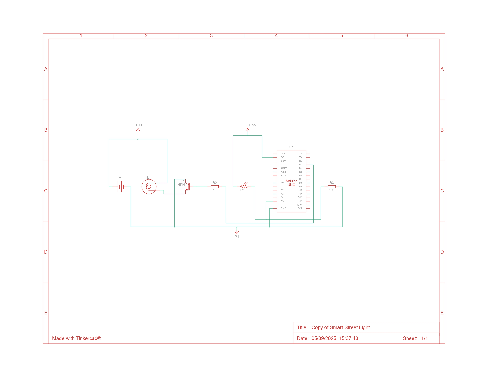
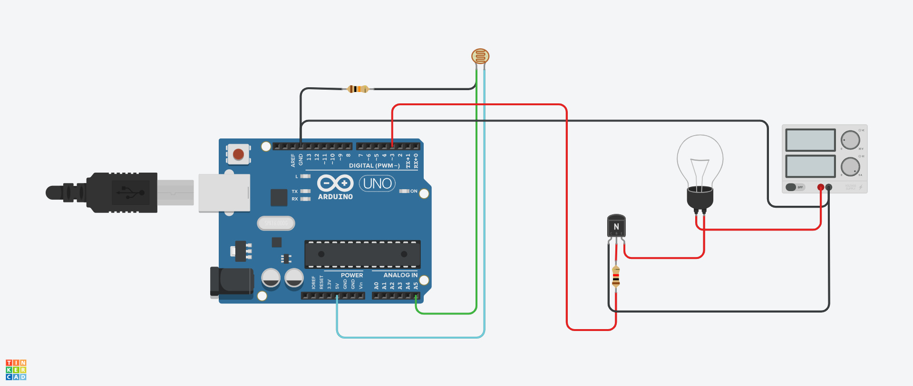

# 💡 Smart Street Light – Arduino Project

This repository contains the source code and setup guide for building a simple **Smart Street Light** using **Arduino Uno**.  
The system uses an **LDR (Light Dependent Resistor)** to detect surrounding brightness and automatically turns a streetlight **ON or OFF**.

This project is designed for **beginners** and will be performed as part of a **student workshop** using **Tinkercad Circuits**.

---

## 📌 Features
- 🌙 Automatically turns the street light **ON** at night (low light)  
- ☀️ Turns the light **OFF** during the day (high light)  
- 🔧 Uses **LDR sensor** as input and **bulb** as output  
- 🖥️ Displays sensor readings and status in the **Serial Monitor**  

---

## ⚡ Circuit Diagram

---

## 🛠️ Components Used

| Label | Quantity | Component |
|-------|----------|-----------|
| T1    | 1 | NPN Transistor (BJT) |
| L1    | 1 | Light bulb |
| P1    | 1 | 5V Power Supply |
| U1    | 1 | Arduino Uno R3 |
| R1    | 1 | Photoresistor (LDR) |
| R2    | 1 | 1 kΩ Resistor |
| R3    | 1 | 10 kΩ Resistor |

---

## 🖥️ Getting Started with Tinkercad

### 1. Create a Tinkercad Account
1. Visit 👉 [https://www.tinkercad.com](https://www.tinkercad.com)  
2. Click **Join Now**  
3. Sign up with your **Google account** or **email ID**  
4. After signing up, log in to your Tinkercad dashboard  

### 2. Create a New Circuit
1. On the dashboard, click **Circuits → Create New Circuit**  
2. Drag and drop the following components from the **components panel**:
   - Arduino Uno R3  
   - Photoresistor (LDR)  
   - Light bulb  
   - Resistors (1kΩ & 10kΩ)  
   - NPN Transistor  
   - Power supply (5V)  
3. Connect the components as described in the **Circuit Setup** section below  

### 3. Upload the Code
1. Click **Code → Text → C++ (Arduino)**  
2. Copy the Arduino code from this repository  
3. Paste it inside the Tinkercad editor  
4. Click **Start Simulation** to run your project  

---

## 🔌 Circuit Setup (Pin Connections)

- **A5** → LDR (Photoresistor) input  
- **D3** → Light bulb output (through NPN transistor)  
- **Power Supply (5V)** → Powers the circuit  
- **Resistors** → Used for proper biasing and LDR sensitivity  

---

## 📜 Arduino Code

The Arduino code is available in this repository.  

### Code Summary:
- Reads **LDR sensor value** from pin A5  
- Compares it with a **threshold value (512)**  
- Turns **light ON** when it’s dark  
- Turns **light OFF** when it’s bright  
- Prints sensor values & status in the **Serial Monitor**  

---

## ▶️ How to Run (Workshop Instructions)
1. Open [Tinkercad Circuits](https://www.tinkercad.com)  
2. Create a new circuit and add the listed components  
3. Wire the circuit as per instructions  
4. Copy-paste the code into the code editor  
5. Start the simulation  
6. Observe how the light turns **ON/OFF** depending on brightness  

---

## 🎯 Workshop Learning Outcomes
- Understand **Photoresistor (LDR) working principle**  
- Learn how to use **Arduino Uno for automation**  
- Practice using **Tinkercad for circuit simulation**  
- Build a functional **Smart Street Light** system  

---

## 👨‍🏫 Trainer & Organizer
**Aryan Pandya** – IoT & Cybersecurity Specialist  
- Conducting IoT, Security & Automation workshops  
- Organizer of community tech meetups & hands-on sessions  

🔗 Connect with me:  
- [LinkedIn](https://www.linkedin.com/in/aryan-pandya)  
- [Instagram](https://instagram.com/yourprofile)  
- [Linktree](https://linktr.ee/yourprofile)  

---

## 📜 License
This repository uses dual licensing:  

- **Code** → MIT License  
- **Slides, Docs & Workshop Materials** → CC BY-NC 4.0  

See the [LICENSE](./LICENSE) file for details.  
