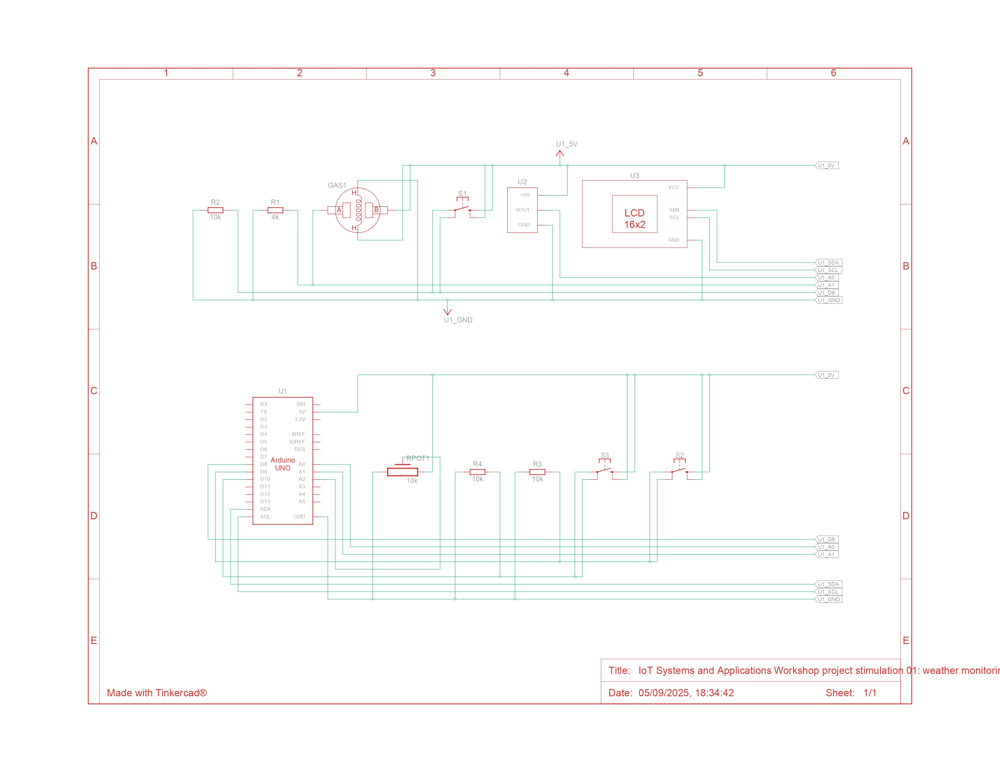

[https://www.tinkercad.com/things/7MCBJ2HEQz6-project-stimulation-02-weather-monitoring-station?sharecode=undefined](https://www.tinkercad.com/things/7MCBJ2HEQz6-project-stimulation-02-weather-monitoring-station?sharecode=VNVADSSn7aQBaEI5H3D-EuOWA37Xi6T7O1XbTCPMKGM)

# 🌦 IoT Weather Station – Arduino Project

This repository contains the source code and setup guide for building a simple *Weather Station* using *Arduino Uno*.  
It measures *Temperature, Air Quality, and Humidity, and displays them on a **16x2 LCD (I2C)*.  

This project is designed for *beginners* and will be performed as part of a *student workshop* using *Tinkercad Circuits*.

---

## 📌 Features
- 📍 Measure *Temperature* using TMP36 sensor  
- 📍 Monitor *Air Quality* using Gas Sensor  
- 📍 Simulate *Humidity* using a Potentiometer  
- 📍 Use *Pushbuttons* to switch between modes:
  - Button 1 → Temperature Mode  
  - Button 2 → Air Quality Mode  
  - Button 3 → Humidity Mode  
- 📍 Display data in real-time on *16x2 LCD (I2C)*  

---

## ⚡ Circuit Diagram

---

## 🛠 Components Used

| Label | Quantity | Component |
|-------|----------|-----------|
| U1    | 1 | Arduino Uno R3 |
| U2    | 1 | Temperature Sensor (TMP36) |
| U3    | 1 | MCP23008-based, 32 (0x20) LCD 16x2 (I2C) |
| S1, S2, S3 | 3 | Pushbuttons |
| R1    | 1 | 4 kΩ Resistor |
| GAS1  | 1 | Gas Sensor |
| R2, R3, R4 | 3 | 10 kΩ Resistors |
| Rpot1 | 1 | 10 kΩ Potentiometer |

---

## 🖥 Getting Started with Tinkercad

### 1. Create a Tinkercad Account
1. Visit 👉 [https://www.tinkercad.com](https://www.tinkercad.com)  
2. Click *Join Now*  
3. Sign up with your *Google account* or *email ID*  
4. After signing up, log in to your Tinkercad dashboard  

### 2. Create a New Circuit
1. On the dashboard, click *Circuits → Create New Circuit*  
2. Drag and drop the following components from the *components panel*:
   - Arduino Uno R3  
   - TMP36 (Temperature Sensor)  
   - Gas Sensor  
   - Potentiometer (to simulate humidity)  
   - 16x2 LCD (with I2C interface)  
   - 3 Pushbuttons + Resistors  
3. Connect the components as described in the *Circuit Setup* section below  

### 3. Upload the Code
1. Click *Code → Text → C++ (Arduino)*  
2. Copy the Arduino code from this repository  
3. Paste it inside the Tinkercad editor  
4. Click *Start Simulation* to run your project  

---

## 🔌 Circuit Setup (Pin Connections)

- *A0* → Temperature Sensor (TMP36)  
- *A1* → Gas Sensor  
- *A2* → Potentiometer (Humidity simulation)  
- *D8* → Pushbutton (Temperature mode)  
- *D9* → Pushbutton (Air Quality mode)  
- *D10* → Pushbutton (Humidity mode)  
- *LCD (I2C)* → Connected via MCP23008 (I2C Address 0x20)    

---

## ▶ How to Run (Workshop Instructions)
1. Open [Tinkercad Circuits](https://www.tinkercad.com)  
2. Create a new circuit and add the listed components  
3. Wire the circuit as per instructions  
4. Copy-paste the code into the code editor  
5. Start the simulation  
6. Use the *3 pushbuttons* to switch between modes:  
   - *Temperature Mode* → Displays °C with status (hot, cold, etc.)  
   - *Air Quality Mode* → Displays gas concentration (ppm)  
   - *Humidity Mode* → Displays % humidity  

---

## 🎯 Workshop Learning Outcomes
- Understand **Arduino basics**  
- Learn how to use **Tinkercad for IoT simulations**  
- Practice connecting **sensors & LCDs**  
- Build a functional **IoT Weather Station**  

---

## 👨‍🏫 Trainer & Organizer
**Aryan Pandya** – IoT & Cybersecurity Specialist  
- Conducting IoT, Security & Automation workshops  
- Organizer of community tech meetups & hands-on sessions  

🔗 Connect with me:  
- [LinkedIn](https://www.linkedin.com/in/aryan-pandya)  
- [Instagram](https://instagram.com/yourprofile)  
- [Linktree](https://linktr.ee/yourprofile)  

---

## 📜 License
This repository uses dual licensing:  

- **Code** → MIT License  
- **Slides, Docs & Workshop Materials** → CC BY-NC 4.0  

See the [LICENSE](./LICENSE) file for details.  

